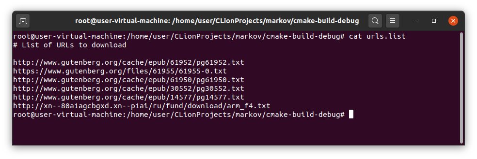
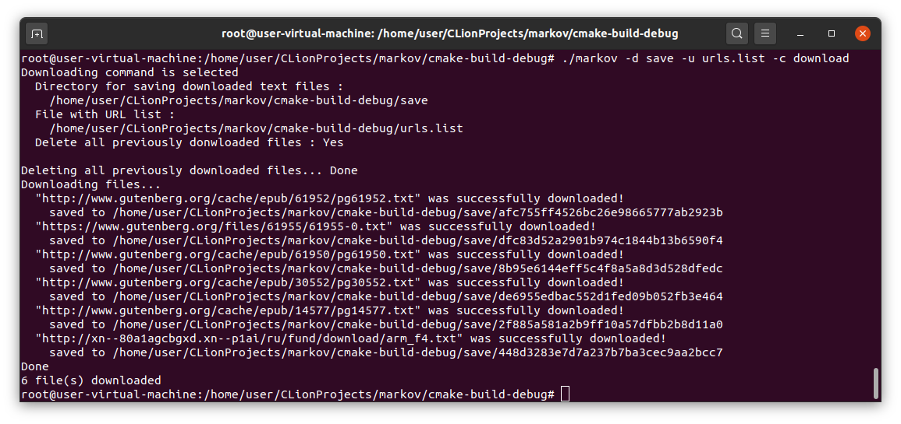
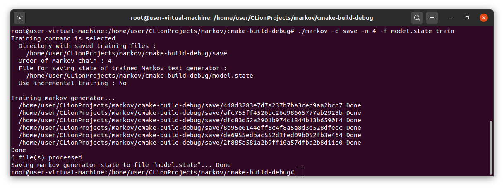
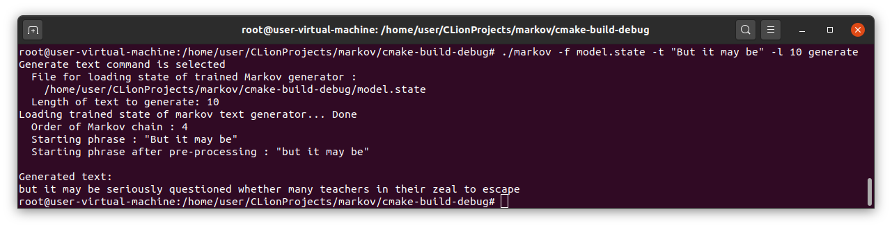
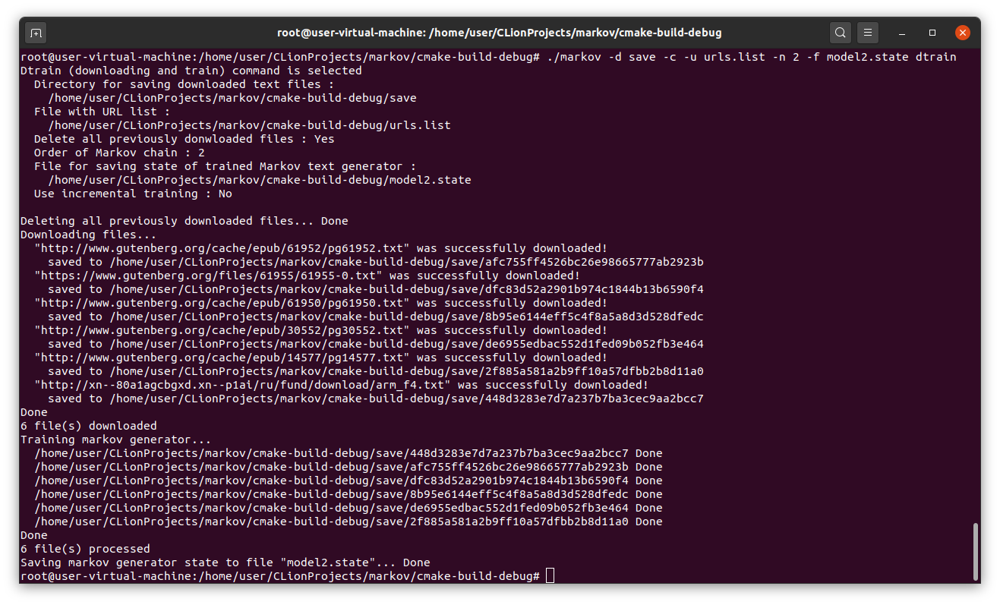
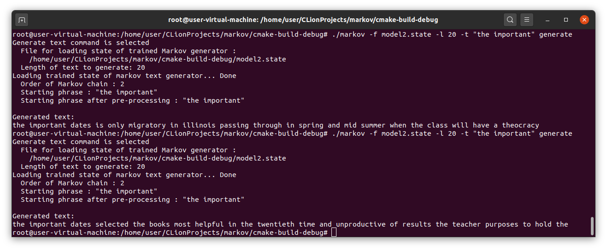
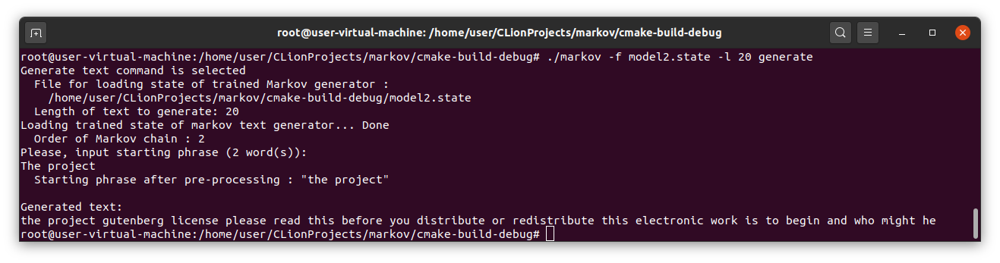
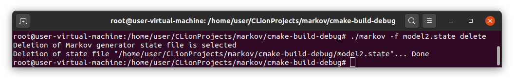
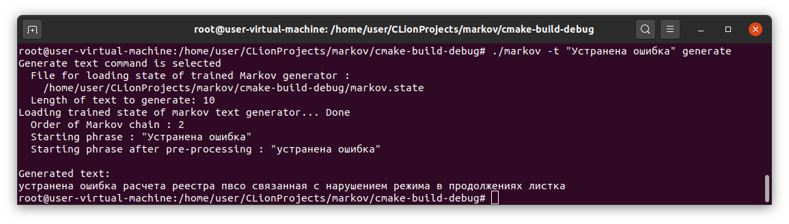
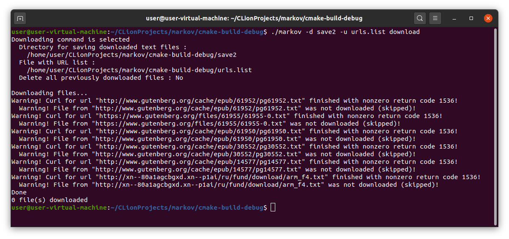

# markov

## Задание

Требуется построить марковcкий генератор текстов n-го порядка (http://ru.wikipedia.org/wiki/Цепь_Маркова).
Логически состоит из двух компонент - обучающей и эксплуатирующей.

Обучающей части на вход подается список урлов, ведущих на текстовые
файлы. Она должна скачать их, вызывая внутри себя утилиту curl и получая от него
данные через пайп. Файлы содержат текст на естественном языке в кодировке UTF-8 (необязательно английском).
Пунктуацию откидываем, морфологию учитывать не нужно, стоит лишь
привести текст к одному регистру, чтобы повысить заполняемость цепи.
Также задается параметр n - порядок цепи. По входному тексту строится
марковская цепь, и сохраняется в файл (можно выдавать в стандартный
вывод).

Эксплуатирующей части на вход подаются начальный отрывок из n слов и
число - количество слов, которые надо достроить по начальному отрывку и
построенной обучающей частью марковской цепи, которую надо загрузить из
файла. Если в какой-то момент программа не знает какую-то
последовательность слов (не встречалась при построении марковской цепи),
то на этом можно построение текста завершить. Вывод надо выдавать в
поток стандартного вывода. Вход можно принимать как со стандартного
потока ввода, так и указанием файлов и параметров в командной
строке, но не хардкодить имена в тексте программы.

Программа должна быть написана на языке C++ с использованием стандарта C++17.
Можно использовать STL и Boost.
Разумеется, ни на каких входных данных программа не должна падать,
вместо этого при ошибке писать текст ошибки и корректно завершаться.
Писать код надо принимая во внимание возможный большой объем данных
и высокую скорость выполнения эксплуатирующей части.

## Реализация
Основные реализованные функциональные возможности:
* Реализована марковская цепь n-го порядка для генерации текстов с использованием эффективных структур данных.
* Поддержка UTF-8
* Реализована поддержка командной строки. Основные команды:

Command | Purpose | Examples
------- | ------- | --------  
`download` | To download and save text files using a url list file | `markov -u urls.list -d downloaded download` 
`train` | To train Markov text generator on downloaded text files | `markov -d downloaded -o 2 -f markov.state train`
`generate` | To generate text using previously trained Markov text generator | `markov -f markov.state -t "starting phrase" -l 10 generate`
`dtrain` | To combine file downloading and Markov generator training | `markov -u urls.list -d downloaded -o 2 -f markov.state dtrain`
`delete` | To delete state file of Markov generator | `markov -f markov.state delete`

* Описание аргументов команд:
```
Usage:
  markov [OPTION...] [command]

  -h, --help           Print help
  -d, --directory arg  Directory to save downloaded training files (default:
                       downloaded)
  -u, --urls arg       File with urls of training files (default: urls.list)
  -c, --clear          Delete all previously downloaded training files in
                       directory (default: 0)
  -n, --order arg      Order of Markov generator (default: 2)
  -f, --file arg       Markov generator state file name (default:
                       markov.state)
  -i, --incremental    Use incremental training (default: 0)
  -l, --length arg     Generated text length (words count) (default: 10)
  -t, --text arg       Starting phrase (default: "")
```

* Основные используемые файлы и каталоги, которые можно завадавать через параметры командной строки:

Назначение | Имя по умолчанию | Опция командной строки 
---------- | ------------- | ----------------------  
Список URL для загрузки | `urls.list` | `--urls urls.list` 
Каталог для сохранения загруженных файлов | `downloaded` | `--directory downloaded`
Файл для сохрания состояние марковского генератора | `markov.state` | `--file markov.state`

* В файле списка URL текстовых файлов для загрузки поддерживаются однострочные комментарии (строки начинаются с `#`) и пустые строки
* Реализована валидация URL-адресов с помощью регулярных выражений
* Загрузка реализуется с помощью функций `popen/pclose`, в которые передается команда `curl`:
```
curl -k -L -s --connect-timeout CURL_CONNECT_TIMEOUT --max-filesize CURL_MAX_FILE_SIZE URL
```
* Анализируются коды возврата `curl` с целью обнаружения ошибочных ситуаций
* Загружаемые файлы получают имена в виде шестнадцаитиричного представления хеш-значения MD5 от их содержимого 
* Для каждой выполняемой команды реализована печать деталей их работы
* Имеется поддержка инкрементального обучения марковской цепи - несколько обучений на разных наборов файлов с получением общего состония
* Реализовано удаление файла с состоянием марковской цепи в виде отдельной команды
* Возможно удаление ранее загруженных файлов в каталоге перед загрузкой новых с помощью опции командной строки
* Реализовано несколько модальных тестов, для их запуска собирается отдельных исполнимый файлов `markov_test`:

```
$ ./markov_test
===============================================================================
All tests passed (11 assertions in 1 test case)

```

Использованные библиотеки:
* STL
* сторонняя библиотека для работы с аргументами командной строки cxxopts (https://github.com/jarro2783/cxxopts)
* простая сторонняя библиотека для модульных тестов Catch2 (https://github.com/catchorg/Catch2)

Направления для развития программы:
* распараллелить загрузку текстовых файлов и обучение
* реализовать соединение нескольких обученных моделей в одну
* написать больше модульных тестов

Примеры работы программы:

* Содержимое файла urls.list



* Работа команды загрузки файлов по URL из urls.list с сохранением в каталог save



* Обучение марковской цепи 4-го порядка на файлах из каталога save с сохранением состояния в model.state



* Загрузка марковской цепи из файла model.state и генерация текста длины 10 на основе зааднной начальной фразы



* Вариант с использованием объединененной команды для загрузки и обучения



* Генерация значений нескольких различных текстов



* Генерация с вводом начальной фразы с клавиатуры



* Удаление файла с состоянием марковского генератора



* Поддержка различных языков (UTF-8)



* Случай, когда нет подключения к Интернет




